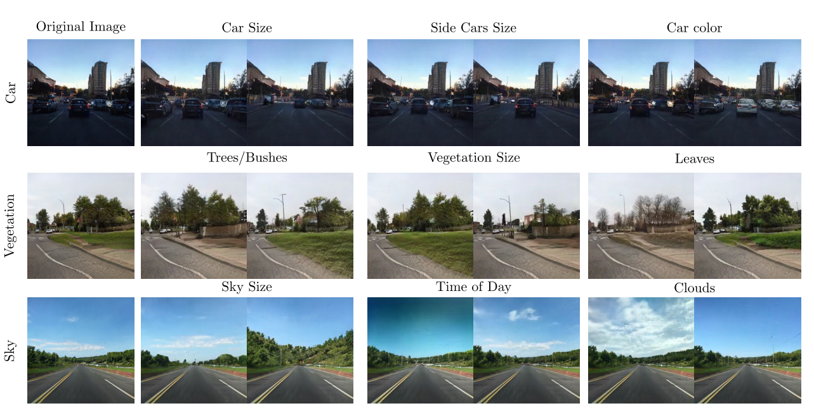

# Urban-StyleGAN: Learning to Generate and Manipulate Images of Urban Scenes

<a href="https://arxiv.org/abs/2305.09602">

> George Eskandar, Youssef Farag, Tarun Yenamandra, Daniel Cremers, Karim Guirguis, Bin Yang
>
> A promise of Generative Adversarial Networks (GANs) is to provide cheap photorealistic data for training and validating AI models in autonomous driving. Despite their huge success, their performance on complex images featuring multiple objects is understudied. While some frameworks produce high-quality street scenes with little to no control over the image content, others offer more control at the expense of high-quality generation. A common limitation of both approaches is the use of global latent codes for the whole image, which hinders the learning of independent object distributions. Motivated by SemanticStyleGAN (SSG), a recent work on latent space disentanglement in human face generation, we propose a novel framework, Urban-StyleGAN, for urban scene generation and manipulation. We find that a straightforward application of SSG leads to poor results because urban scenes are more complex than human faces. To provide a more compact yet disentangled latent representation, we develop a class grouping strategy wherein individual classes are grouped into super-classes. Moreover, we employ an unsupervised latent exploration algorithm in the S-space of the generator and show that it is more efficient than the conventional W+-space in controlling the image content. Results on the Cityscapes and Mapillary datasets show the proposed approach achieves significantly more controllability and improved image quality than previous approaches on urban scenes and is on par with general-purpose non-controllable generative models (like StyleGAN2) in terms of quality.

<a></a>

# Description

Official Implementation of our Urban-StyleGan paper for training and inference. The code is based on SemanticStyleGAN Implementation <a href="https://github.com/seasonSH/SemanticStyleGAN">.

# Table of Contents

- [Installation]
- [Rough Installation instructions]
- [Preprocessing]
- [LatentSpaceExploration]
- [Credits]
- [Acknowledgments]
- [Citation]

# Installation

- Python 3.9
- Pytorch 1.8+
- cuda 11.3+
- Run `pip install -r requirements.txt` to install additional dependencies.

# Rough Installation instructions

- create new enviornment using python 3.9 (conda env)
  -conda install pytorch torchvision torchaudio pytorch-cuda=11.7 -c pytorch -c nvidia
  <br>

# Preprocessing Steps

First preprocess a given dataset using a predfined mapping from ./data.

```
python ./data/preprocess_cityscapes.py --data={input_data_label_location} --output={output_data_label_locatyion}

```

Prepare the lmdb dataset using prepeare_mask_data.py.

```
python  prepare_mask_data.py --cityscapes "True" {images_location} {preprocessed_labels location} --out {output location} --size 256

```

Prepare the Inception network used to calculate FID results.

```
python prepare_inception.py {lmdb_dataset_location} --output \{output_location}--size 256 --dataset_type mask
```

Train the model on the preprocessed data, using.

```
 python3.9  train.py --dataset {dataset_lmdb_location} --inception {inception_pkl_location} --save_every {num_of_iterations} --checkpoint_dir {checkpoint_output_directory} --ckpt {checkpoint_location_in_case_of_resuming_training}  --seg_dim {number_of_classes_in_dataset} --size 256  --residual_refine

```

P.S: to add a new dataset, a new preprocessing algorithm should be added to ./data/preprocess\_{new_data_set}, and a new matching algorithm between labels and images should be implemented in prepeare_mask_data.py.

# Latent Space Exploration

We explored the latent space for each local generator in our network using various methods.

1. Exploring the W space using GANSpace vectors.
2. Exploring the S Space using GANSpace vectors.
3. Exploring S space using Sefa extracted vectors.

The first method of exploring w space is present in the second section of notebooks/controllability_w_space.ipynb, while S-space related explorations are present in controllability_s_space.ipynb

# Credits

**StyleGAN2 model and implementation:**  
https://github.com/rosinality/stylegan2-pytorch  
Copyright (c) 2019 Kim Seonghyeon  
License (MIT) https://github.com/rosinality/stylegan2-pytorch/blob/master/LICENSE

**LPIPS model and implementation:**  
https://github.com/S-aiueo32/lpips-pytorch  
Copyright (c) 2020, Sou Uchida  
License (BSD 2-Clause) https://github.com/S-aiueo32/lpips-pytorch/blob/master/LICENSE

**ReStyle model and implementation:**  
https://github.com/yuval-alaluf/restyle-encoder  
Copyright (c) 2021 Yuval Alaluf  
License (MIT) https://github.com/yuval-alaluf/restyle-encoder/blob/main/LICENSE

**SemanticStyleGAN model and implementation:**  
https://github.com/seasonSH/SemanticStyleGAN
Copyright (C) 2022 ByteDance Inc.
License (MIT) https://github.com/seasonSH/SemanticStyleGAN/tree/main/LICENSES

**Please Note**: The CUDA files are made available under the [Nvidia Source Code License-NC](https://nvlabs.github.io/stylegan2/license.html)

# Acknowledgments

This code is initialy built from [SemanticStyleGAN](https://github.com/seasonSH/SemanticStyleGAN).

# Citation

If you use this code for your research, please cite the following work:

```
@misc{eskandar2023urbanstylegan,
  title={Urban-StyleGAN: Learning to Generate and Manipulate Images of Urban Scenes},
  author={George Eskandar and Youssef Farag and Tarun Yenamandra and Daniel Cremers and Karim Guirguis and Bin Yang},
  year={2023},
  eprint={2305.09602},
  archivePrefix={arXiv},
  primaryClass={cs.CV}
}
```
